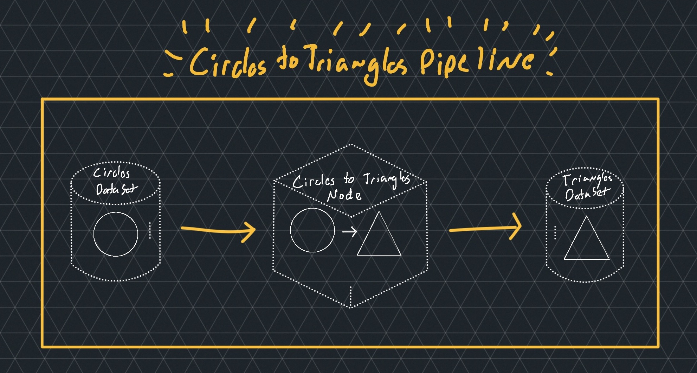
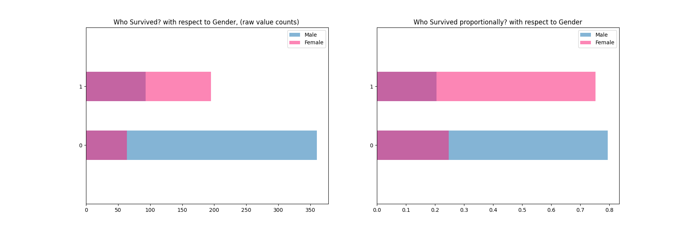
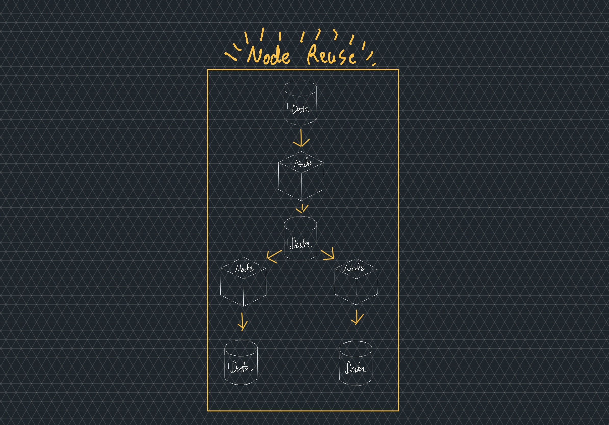
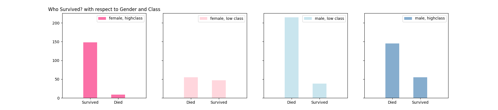
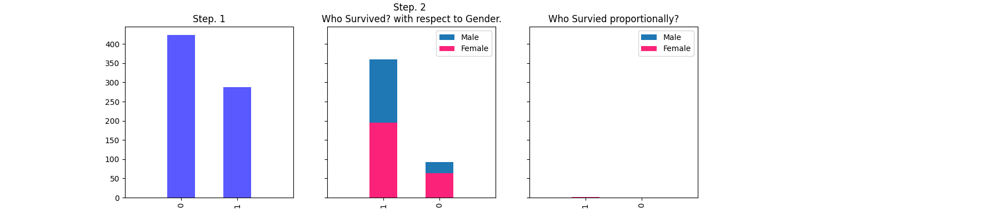
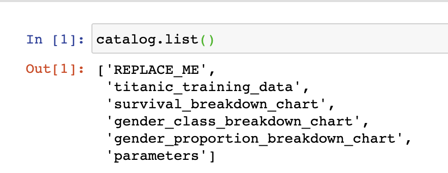
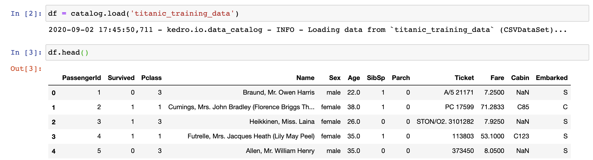
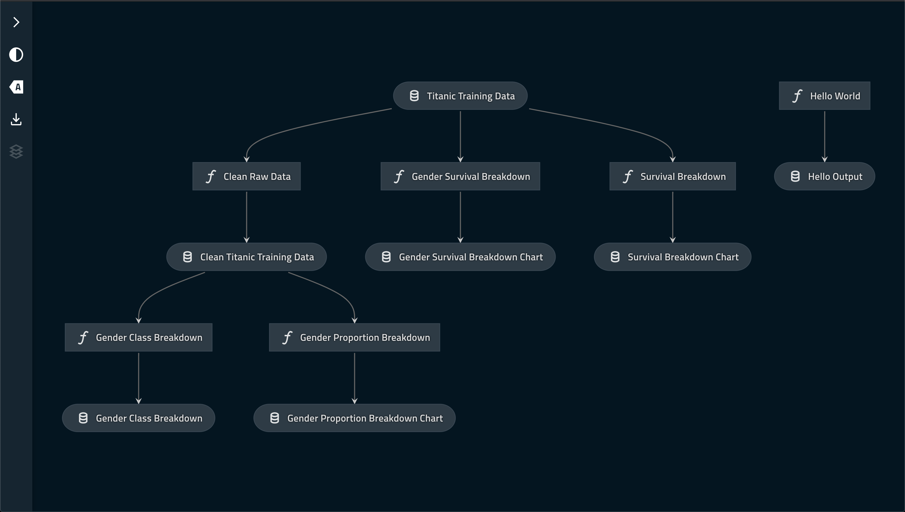

# vdxo_0.17.4
Use branch vdxo_0.17.4 for kedro version 0.17.4
https://github.com/tamsanh/kedro-introduction-tutorial/tree/vdxo_0.17.4

# Kedro Introduction Tutorial

Checkout the Video Here: [The Complete Beginner's Guide to Kedro - How to use Kedro 0.16.4
](https://www.youtube.com/watch?v=x97ChYDd12U). Note: `pipeline.py` has been changed to `hooks.py` in 0.16.5. This has been updated in this repository.

## Overview

This project helps understand the basics of kedro by introducing you, in a step by step fashion, to its different concepts and tools.

By following along with this project, you will understand the concepts of **nodes**, **pipelines**, and **datasets**, and how to leverage them to create collaborative, scalable, production-ready data pipelines.

#### Credits

A huge thank you to [@agconti](https://github.com/agconti), whose notebook this tutorial is heavily based on. Checkout his notebook here: [Titanic.ipynb](https://nbviewer.jupyter.org/github/agconti/kaggle-titanic/blob/master/Titanic.ipynb)

Another thank you to [Kaggle.com](kaggle.com), who was the provider of this titanic dataset in the competition [Titanic: Machine Learning from Disaster]()

## Why Kedro?

For most individuals, you often will build a data pipeline in the following way:

```python
# run.py
import pandas as pd
from datetime import timedelta

def main():
  data = pd.read_csv('data.csv')
  timezone_offset = 8
  data['date'] = pd.to_datetime(data['date']) + timedelta(hours=timezone_offset)
  data.to_csv('clean_data.csv')

```

What's wrong with this code?

1. Untraceable data
2. Untestable functions
3. Hardcoded parameters

## Tutorial

To get started with this tutorial, make sure to first clone it using

```bash
git clone https://github.com/tamsanh/kedro-introduction-tutorial
```

### Part 0: Getting Kedro

#### Python Environment

I recommend to use a virtual environment, or conda environment for the purposes of this tutorial, and instructions to set that up are included below, for your convenience.

##### Setting up Conda
```bash
# With Conda
conda create python=3.8 --name kedro-tutorial-conda
conda activate !$
```

##### Setting up Virtual Environment
```bash
# With Virtual Environment (MacOSX)
virtualenv venv
source !$/bin/activate
```

#### Installing Kedro

Kedro may be installed simply by using `pip` and the Python Package Index. For the purposes of this project, we will be installing all of the following packages.

```bash
# Console
pip install kedro==0.16.5
pip install kedro[pandas]==0.16.5 # Pandas is installed separately due a bug with pip.
pip install kedro-viz scipy matplotlib
```

**Note**: To reduce package size, kedro has split its package into multiple, smaller packages, which can be installed with `kedro[PACKAGE_NAME]`, where `PACKAGE_NAME` is the subpackage one wishes to include.

### Part 1: Hello World

#### Introduction to CLI

In order to interact with kedro, we use the kedro command line interface (CLI). Let's first get acquainted with the most important command, the `kedro run` command.

The `kedro run` command allows us to run our pipelines. But what pipelines exist to run? Using the following command, we can list all the pipelines that are available.

```
kedro pipeline list
```

This will output a list of all pipelines available to us. But where are they instantiated?

Traditionally, they can be found inside of the `src/{project_name}/hooks.py` file (in our case, our project name is `kit`).

Looking inside of this file, we find a function called `create_pipelines`. By default, it is this function that is used by kedro to create the pipelines for our run. Notice the dictionary being returned, at the bottom. This dictionary is what determines the available pipelines for us to run.

There's one pipeline in particular we're going to try running, and that's the `hello-world` pipeline. Any keys in the dictionary being returned are available to the `kedro run` command.

```python
# src/kit/hooks.py
class ProjectHooks:
    @hook_impl
    def register_pipelines(self) -> Dict[str, Pipeline]:
        ...
        return {
            ...
            "hello-world": hello_world.create_pipeline(),
            ...
        }

```

*Note: Notice that the value is actually being created inside of the module called `hello_world`, which exists inside of `src/kit/pipelines/`. Putting the pipeline implementation inside of the `pipelines` folder is a standard convention, to help encourage pipeline reuse.*

#### Run the Pipeline

Let's run the pipeline! Make sure you `cd` into the `titanic-tutorial-starter` project, first.

```bash
# Console
kedro run --pipeline hello-world
```

You should get an output similar to this

```bash
2020-08-31 09:48:07,098 - root - INFO - ** Kedro project kedro-introducgtion-tutorial
2020-08-31 09:48:07,903 - kedro.pipeline.node - INFO - Running node: hello_world(None) -> [hello-output]
2020-08-31 09:48:07,903 - kit.pipelines.hello_world.nodes - INFO - Hello World!
2020-08-31 09:48:07,904 - kedro.io.data_catalog - INFO - Saving data to `hello-output` (MemoryDataSet)...
2020-08-31 09:48:07,904 - kedro.runner.sequential_runner - INFO - Completed 1 out of 1 tasks
2020-08-31 09:48:07,904 - kedro.runner.sequential_runner - INFO - Pipeline execution completed successfully.
2020-08-31 09:48:07,904 - kedro.io.data_catalog - INFO - Loading data from `hello-output` (MemoryDataSet)...
```

We did it! Congratulations, you've just successfully run a kedro pipeline.

### Part 2: Connecting a DataSet to Nodes in a Pipeline

#### Explanation of Kedro Concepts

Now that we know how to run pipelines, let's get a handle on what a "pipeline" actually is.

In kedro, there are 3 important constructs to understand. In this section, we're going to cover 

1. Pipelines
2. Nodes
3. DataSets

We've already run our first pipeline, but what is a pipeline, exactly? A pipeline is a simple construct that ties all of your data (in the form of DataSets) and transformations (in the form of nodes). You put data in one side, and out the other side comes transformed data.

Represented in the following illustration is a "Circles to Triangles Pipeline." Here, the cylinders represent DataSets, the cube represents a Node, and all of the Yellow represents the Pipeline.  
The "Circles DataSet" is a data source that contains a "rows of circles" and the transformation function will take each "circle row" turning it into a "triangle row," outputting it to a "Triangles DataSet."

The important thing to point out is all of the yellow, which represents the Pipeline.  
It's responsible for tying all of the DataSets and Nodes together by

1. Moving data from the input DataSet into the Node
2. Moving data from the Node into the output DataSet

Below, "Circles" is the input DataSet and "Triangles" is the output DataSet.



If the previous illustration were to be represented in Pipeline code, it would look like this.

```python
# nodes.py
import pandas as pd
from .lib import inscribe_triangles

def circles_to_triangles(circles: pd.DataFrame) -> pd.DataFrame:
    """
    Takes a collection of circles, inscribes a triangle in each circle,
    returns the collection of inscribed triangles.
    """
    return circles.apply(inscribe_triangles, axis=1)

# pipeline.py
from kedro.pipeline import Pipeline, node
from .nodes import circles_to_triangles

def create_pipeline():
    # Create the pipeline that will transfer the appropriate
    # data to the proper locations.
    return Pipeline([
        node(
            circles_to_triangle,
            inputs="circles",
            outputs="triangles",
        )       
    ])
```

The `node` function requires three arguments in order to create a node. The first is a function, representing the function the node is to run, the second is the inputs to the function and the third is the outputs of that function. Kedro will take the input data as pass it to the function directly to the arguments of the function, as well as take any output of the function and pass it to output datasets.

Additionally, there would also be catalog entries corresponding to the two datasets.

```yaml
circles:
  type: pandas.CSVDataSet
  filepath: data/01_raw/circles.csv

triangles:
  type: pandas.CSVDataSet
  filepath: data/02_intermediate/triangles.csv
```

#### Connecting our DataSet to our Node

In order to make data portable, kedro separates the actual file location of files from the reference to the files. In this case `survival_breakdown_chart` is a reference to a dictionary entry that contains the actual catalog entry.

The catalog entry is located inside of the `conf/base/catalog.yml`, and if you open this file, you will see a depiction of all the files that kedro has access to.

Let's take a look at one of the catalog entries that we will be using later:

```yaml
titanic_training_data:
  type: pandas.CSVDataSet
  filepath: data/01_raw/train.csv
```

In this example, we have a dataset that has a type of `pandas.CSVDataSet`. This particular type will use `pandas.read_csv` to load the `train.csv` file into memory, passing it into the pipeline. There are many different available built-in dataset types; all can be found [here in the kedro documentation](https://github.com/quantumblacklabs/kedro/tree/master/kedro/extras/datasets).

For this exercise, we're going to be connecting the `titanic_training_data` DataSet in the `survival_breakdown` pipeline.

Remove the `REPLACE_ME` dataset and add in the `titanic_training_data` as value for `inputs`, inside of the `survival_breakdown` pipeline, for the `survival_breakdown` node.

```python
def create_pipeline(**kwargs):
    return Pipeline([
        node(
            survival_breakdown,
            # inputs="REPLACE_ME"
            inputs="titanic_training_data",
            outputs="survival_breakdown_chart"
        )
    ])
```

And now let's go ahead and run the `survival-breakdown` pipeline with `kedro run --pipeline survival-breakdown`.

Referring back to our `surivival_breakdown_chart` dataset, we can see that the `type` is different than the previous dataset: it's a `matplotlib.MatplotlibWriter` type. This type will accept a matplotlib Figure, and save it to disk at the chosen location specified by the `filepath`.

```yaml
survival_breakdown_chart:
  type: matplotlib.MatplotlibWriter
  filepath: data/08_reporting/survival_breakdown.png
```

As we can see, the `filepath` for this chart is located inside of the `data/08_reporting/survival_breakdown.png` folder.
The `data` has a lot of different subfolders. To understand the meaning of all of them, you can take a look at this page on the kedro documentation: [What is data engineering convention?](https://kedro.readthedocs.io/en/stable/11_faq/01_faq.html?highlight=reporting#what-is-data-engineering-convention).

Opening up our file, we can see it should look something like this:


Neat! It's a simple node that outputs a simple result.

#### About Parameters

Kedro comes with great support for parameterizing your nodes.
Normally, parameters are haphazardly hard coded, with little documentation.

Kedro turns this around by allowing users to put parameters into the `parameter.yml` file, located in `conf/base/` configuration folder.

Any key/value pair that is added to this file will be accessible in the pipeline using the special `params:` prefix.
The data from the value will then be passed to the function just as any DataSet value would be.

Take a look at the following example to get the gist.

```python
# nodes.py
def print_favorite_soda(fav):
  print(f'My favorite soda is "${fav}"!')

# pipeline.py
def create_pipelines():
  return Pipeline([
    node(
      print_favorite_soda,
      inputs='params:favorite_soda',
      outputs=None,
    )
  ])

# parameters.yml
favorite_soda: coke

# Console
>> My favorite soda is "coke"!
```

As you can see, the value for the parameter `favorite_soda` is being passed into the `print_favorite_soda` function. With this method, you can manage all of your parameters without worry. See the [kedro documentation on parameters](https://kedro.readthedocs.io/en/stable/04_kedro_project_setup/02_configuration.html?highlight=parameters#parameters) for more details.


### Part 3: Creating Our Own DataSet

In this section, we're going to create a new dataset to hookup to a new pipeline, to retrieve its output.

Let's start by running the pipeline called `gender-survival-breakdown`.

The pipeline seems to run fine, but there's a problem: *Where does the output get saved?*

If we take a closer look at the pipeline, you'll see that the output is a `None`. This is a completely valid output, and it tells kedro to ignore the output data.
However, we want to grab that output, so let's create a dataset in the catalog to capture that output.

Let's use the following dataset definition, and replace the `None` with our new dataset definition.

```yaml
gender_survival_breakdown_chart:
  type: matplotlib.MatplotlibWriter
  filepath: data/08_reporting/gender_survival_breakdown.png
```

When we rerun the pipeline, we should be able to find the new chart within the `08_reporting` folder, in our data directory! The chart should look something like the following.



As you can see, kedro makes it really easy to inject new datasets to both load and save data.

**Note:** By default, if there exists a parameter for `inputs` or `outputs` that does not have an entry in the catalog, that is totally fine. By default, kedro will create a `MemoryDataSet`, meaning the data gets saved to memory.

### Part 4: Connecting Nodes in a Pipeline

Now that we understand how to run pipelines and how to create catalog datasets, let's focus on connecting nodes together in a pipeline.

#### Understanding Node Reuse

In this section, we're going to demonstrate one of the great aspects of kedro: Reusability. So far, we haven't done much that's different from a normal data pipeline, as our functions have been relatively self-contained.
That'll change in this section, when we begin to connect nodes together in a manner that allows us to take advantage of inputs and outputs.

Basically, we are going to bifurcate the output of one node into two nodes, thereby allowing the two downstream nodes to take advantage of the work done in the first node. You can refer to the following illustration demonstrating this relationship.

The point here being that the first node does work that the second and third node BOTH get to take advantage of. This means that, in a kedro pipeline, if someone writes a node, anyone else who uses that pipeline can also take advantage of that node.
This reduces labor overall and accelerates pipeline development.



#### Modifying the Pipeline

The pipeline in question this time is going to be the `class_gender_survival_breakdown` pipeline. It contains three nodes that we'll be using. Opening up the `pipeline.py` file shows us what we have and what we're missing.

```python
from .nodes import clean_raw_data, \
    gender_class_breakdown, \
    gender_proportion_breakdown


def create_pipeline(**kwargs):
    return Pipeline([
        node(
            clean_raw_data,
            inputs='titanic_training_data',
            outputs='clean_titanic_training_data',
        ),
        node(replace_me1, inputs="REPLACE_ME", outputs=None),
        node(replace_me2, inputs="REPLACE_ME", outputs=None),
    ])
```

All we need to do is add in our two functions `gender_class_breakdown` and `gender_proportion_breakdown` to the pipeline.

This can be done by replacing the `replace_me` functions with the appropriate functions, as well as add in the appropriate `inputs` and `outputs`.

For the `inputs`, make sure to use the output of the `clean_raw_data` function, which is the `clean_titanic_training_data`. *This is exactly how reuse is done.*

There are already pre-made catalog entries for these two nodes, which are `gender_class_breakdown_chart` and `gender_proportion_breakdown_chart`, which we can use.

Once that is done, run the pipeline again with `kedro run --pipeline class-gender-survival-breakdown`, and we should get two more charts that look like the following.





### Part 5: Creating a Pipeline from Scratch

For the final portion of the pipeline part of the tutorial, we've just got one thing left to do: Let's create a pipeline from scratch.

The task is actually not too difficult. Thanks to kedro. Built into the CLI is an option for pipeline creation. Using the CLI, we just do the following command.

```bash
kedro pipeline create [INSERT PIPELINE NAME]
```

Kedro will create a pipeline for us inside of the `pipelines` folder in our project, named with whatever name we give it.

Let's create a pipeline called "final_pipeline" with the command `kedro pipeline create final_pipeline`. We're going to be using a premade node for this pipeline, which can be find inside of `kit/pipelines/final_node.py`.
Inside of that file, we have the function `final_pipeline_tutorial_node` which we can add to the pipeline as a node.

If you have been following the tutorial so far, you should have all the skills you need to get the output of this node on your own!

## Extra Kedro Goodness

### Access through Jupyter Notebook

If kedro was pipeline only, that would be a bit unfortunate, as most modern data science is done. Thankfully, kedro has a fantastic integration with your kedro notebooks.
The integration allows you to access the catalog data within the notebook very easily and also comes with the ability to extract any cells you create in the notebook and put them back into your project.

There are three ways to get to get access to your kedro catalog via the notebook. These are in order of preference.

#### Setting Up the Notebooks

All of these methods will give you access to the catalog and context.

##### Start Jupyter with Kedro

If you start jupyter with kedro, you will automatically get access to the `catalog` and the `context`.

```bash
kedro jupyter notebook
```

##### Call the Kedro Initialization Function Inside an Existing Notebook

If you already have a jupyter notebook started up, you can simply call the init script that kedro normally uses.

For the `[PATH TO PROJECT ROOT]`, this can be relative or absolute.


```
%run '[PATH TO PROJECT ROOT]/.ipython/profile_default/startup/00-kedro-init.py'
```


If you are in the `notebooks` folder, you can simply use `..` for the relative path.


##### Load the Project Manually

If the above methods are not available to you, this final method will work for you (and this method can also be used to get access to a kedro project in another python project).

Just replace the `PATH_TO_PROJECT_ROOT` with your actual project root path. This can also be relative, but I recommend using absolute.

```python
from kedro.framework.context import load_context

context = load_context(PATH_TO_PROJECT_ROOT)
catalog = context.catalog
```

#### Using the Catalog in the Notebook

The catalog is what allows us to load data from our project inside of our notebook.

First use the `catalog.list()` function to list out all of the available datasets.

This will print out all of the datasets we have available to load from, which are the ones listed in the `catalog.yml` by default.



Then, we can use `catalog.load(DATASET_NAME)` to load the dataset we wish to load.



And that's it! Now you can go nuts with data analytics, while still piggybacking off of the work you and your colleagues have done.


#### Newly Minted Features for Further Study

This new-found construct was introduced in kedro `0.16.5`, and is here to stay. Hooks are now the canonical way of managing
your pipeline and its state.

The new object `KedroSession` was introduced in `0.17.0`, and it manages the entirety of pipeline state, across multiple
runs.

### Visualizing All of Our Work

Once all of the pipelines have been completed, it would be great to visualize all of our work. In order to do this, kedro has a visualization tool called `kedro-viz` which we can get by simply using `pip install kedro-viz`.

The visualization tool relies on whatever is available in the `__default__` pipeline to create its visualization. In the case of this project, all the pipelines are available in the `__default__` pipeline, so can be visualized by running the following command:

```bash
kedro viz
```

Your default webbrowser will open up, and you'll be greeted by a lovely visualization of your pipeline!

If you followed the tutorial thus far, you should get an output that looks something like this (this picture does not include the final created pipeline).



## Congrats!

You now know the basics of using kedro, and are equipped to go on to make some great things. Thank you for joining me on this journey!
